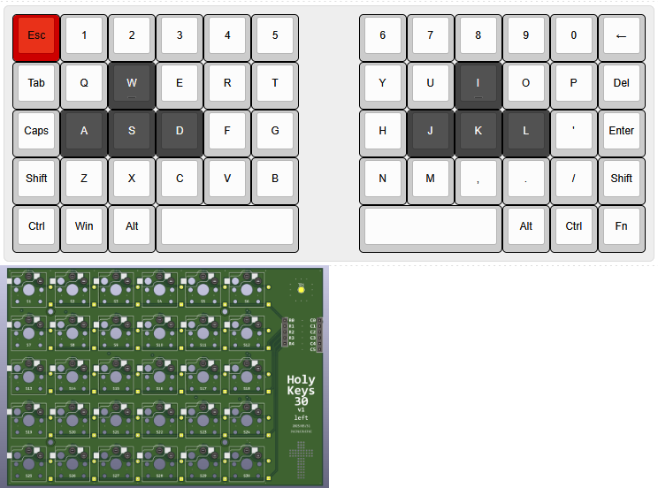

## Concept
I wanted a one-handed keyboard for gaming on the go, but the offerings on the market seemed cheap, quiet pricy and way to RGB and aggressive looking.
I decided to give it a try and started a wish-list:

1. wired (for now)
2. no RGB
3. no extras like a screen or knobs (for now)
4. no layering (broke that rule)

After getting started I decided to design the PCB 100% reversible, so I could populate it from either side and use the same PCB for a right or left hand keyboard if I ever wanted to extend this project to an actual typing keyboard.

## Layout
I used Keyboard Layout Editor and came up with [this design](https://keyboard-layout-editor.com/##@@_c=%23cc0000&a:7%3B&=Esc&_c=%23cccccc%3B&=1&=2&=3&=4&=5&_x:1.25%3B&=6&=7&=8&=9&=0&=%E2%86%90%3B&@=Tab&=Q&_c=%23444444&t=%23Cccccc&n:true%3B&=W&_c=%23cccccc&t=%23000000%3B&=E&=R&=T&_x:1.25%3B&=Y&=U&_c=%23444444&t=%23cccccc&n:true%3B&=I&_c=%23cccccc&t=%23000000%3B&=O&=P&=Del%3B&@=Caps&_c=%23444444&t=%23CCCCCC%3B&=A&_t=%23Cccccc%3B&=S&=D&_c=%23cccccc&t=%23000000%3B&=F&=G&_x:1.25%3B&=H&_c=%23444444&t=%23cccccc%3B&=J&=K&=L&_c=%23cccccc&t=%23000000%3B&='&=Enter%3B&@=Shift&=Z&=X&=C&=V&=B&_x:1.25%3B&=N&=M&=,&=.&=%2F%2F&=Shift%3B&@=Ctrl&=Win&=Alt&_w:3%3B&=&_x:1.25&w:3%3B&=&=Alt&=Ctrl&=Fn) for both sides.
The 3u spacebar will still have all three units populated with hot swap sockets in case I want to actually use all 30 keys of the 6x5 grid.

## Switches
I defininetily wanted low-profile switches, finally deciding on Kalih Choc V2. I ordered a bunch of different switches to test out, but after playing around I landed on basic linear Reds. I will give tactile switches a try in the future.

## MCU-Selection
The Arduino Pro Micro seemed like the easiest and most popular choice, but I also ordered some others to play around with. The nRF-series seems very promosing in the future.
I designed the PCB to only have pin-sockets for the actual rows and columns I need, so I won't settle for on specific MCU right away, but can swap them out easily.

## Firmware
For the sake of fun I decided to write the firmware myself as a challenge for learning some more micro-controller programming.

## KiCAD libraries
* [kiswitch library](https://github.com/kiswitch/kiswitch)
* [ScottoKeebs library](https://github.com/joe-scotto/scottokeebs/tree/main/Extras/ScottoKicad)

*As said above I may have misused the relative paths for these libraries, so it needs fixing*